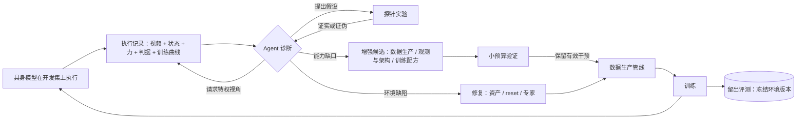

# 让 Agent 做具身模型的研发工程师：从执行记录推断能力缺口，改数据、环境与架构

研究规划 · 草案 v2 · 2026-09-25（2026-09-26 更新 RoboTwin 基线与评测协议）（v1 保存在 `具身失败闭环研究规划_v1.md`）

Agent 读具身模型执行后留下的完整记录（视频与数值），推断模型欠缺哪些能力、或环境本身有什么缺陷，然后修改模型的研发管线：训练数据生产、仿真训练环境、观测与架构、训练配方。每一轮迭代产出的是一个更好的研发配置，模型参数更新只是这个配置执行后的结果。

- 基座：**π₀.₅（openpi）**，DM0.5 作第二基座
- 主基准：**RoboTwin 2.0 hard**
- 辅基准：**LIBERO-PRO / Plus**、**AM-Bench**
- 最近工作：**RoboCoach（Level 2）**

---

## 1. 定位

| 项 | 内容 |
|---|---|
| Agent 的角色 | 具身模型的研发工程师，不是模型的一部分。不把视频喂给具身模型让它自我改进，也不通过 in-context learning 或 RL 直接更新参数 |
| 输入 | 执行记录：多视角 rollout 视频、状态量、动作、力、成功判据与子判据、训练曲线 |
| 推断 | 模型欠缺什么能力，或者失败根本不是模型的问题而是环境缺陷 |
| 改动对象 | 研发管线四层：训练数据生产管线、仿真训练环境与资产、观测模态与模型架构、训练配方 |
| 产出 | 每轮一个研发配置，经留出协议评测后决定保留、回滚或分支 |

RoboCoach（arXiv 2601.21570）提出了一张自动化具身开发路线图：Level 1 自动化单个组件，Level 2 在固定任务和评测下自主开发单个策略，Level 3 开发跨任务、跨本体的具身基础模型。RoboCoach 自称做到 Level 2，且只改训练代码。我们的目标是往 Level 3 走：研发对象是多任务 VLA，编辑范围下沉到数据生产和训练环境。

## 2. 动机：我们已经手工跑通过一次这个闭环

在 AM-Bench（空中操作，12 任务）上，我们用一周时间反复执行"看评测失败视频与数值记录 → 判断是环境问题还是能力缺口 → 修改研发管线 → 重录 → 训练评测"。π₀.₅ 固定配方 12 任务宏平均 56.7，组合最优 65.3，超过论文 ST-FT 的 52.22；三个专家成功率为 0 的任务全部修到可用。每一步改的都是研发管线，没有一步是让模型自己看视频。

| 任务 | 失败现象 | 判断 | 改动的研发管线层 | 结果 |
|---|---|---|---|---|
| FrameAssembly | 夹爪一直闭合，框架却下滑 | 环境缺陷：把手短柱无碰撞体 | 仿真环境与资产 | 专家 0/16 → 80/80 |
| TossBall | 一开始运动球就掉 | 环境缺陷：夹持 reset 缺宽度换算、实心桶；专家缺陷：低头把球压在机臂上 | 仿真环境、数据生产（弹道专家） | 专家 0/462 → 80/80 |
| WipeWindow | 擦两三下海绵就掉 | 环境缺陷加能力缺口：海绵未夹住；位置控制调不出接触力 | 仿真环境、数据生产（力伺服专家）、观测（腕部六维力） | 专家 0/32 → 80/164 |
| PushSlider | π₀.₅ 夹住后 z 向上滑脱 | 能力缺口：看不到与导轨的相对位置，偏离后不会纠正 | 观测与架构（机载相机）、数据生产（注噪纠正演示） | 模型 0 → 100 |
| RotateValve | 加机载相机后超时增多 | 同一干预对不同任务作用相反 | 观测与架构 | 模型 56.7 → 26.7 |

两条经验：

- **不看视频无法理解失败。** TossBall 只凭日志先后怀疑刚度、摩擦、求解器、质量，全部无效，看帧才发现球被压在机臂上。
- **光看视频也不够。** 夹爪开度 0.002、球进桶瞬间被 reset、桶是实心的，都靠状态量、逐步轨迹和对照实验才确认。

## 3. 相关工作与空白

按"Agent 能改研发管线的哪几层"对比最近的工作。✓ 表示由诊断驱动的闭环覆盖，△ 表示有技术积累但不受诊断驱动，— 表示未涉及。

| 工作 | 训练代码与超参 | 数据生产 | 仿真环境与资产 | 观测与架构 | 备注 |
|---|---|---|---|---|---|
| RoboCoach（2601.21570，2026-01） | ✓ | — | — | △ 网络结构 | Level 2；32 任务均值 0.73 对人类 0.60；视频通道消融贡献约 0.05 |
| ENPIRE（2606.19980，2026-06） | ✓ | — | △ 真机复位校验 | — | 真机版的同类闭环 |
| EvoMaster（2604.17406，2026-04） | ✓ | — | — | — | RoboCoach 同组，推广到通用科研循环 |
| EmboMatrix（2510.12072，2025-10） | — | △ | △ | — | RoboCoach 同组的数据与仿真引擎，未接诊断闭环 |
| FATE / Scene2Demo / SimWorld Studio（2026） | — | △ | △ 任务层 | — | 失败触发的任务或动作流程修改，未下沉到资产与物理 |
| RISE / GigaBrain / SimpleVLA-RL / π*0.6 | — | △ 自采 rollout | — | — | 固定管线下更新参数，作为对照组 |
| **本研究** | ✓ | ✓ | ✓ | ✓ | 诊断驱动，覆盖四层，区分环境缺陷与能力缺口 |

- **失败理解**一类（KITE、ProTracer、FailBench、LabRobFail、Robot Critics、Fail-RAG 等）在 2026 年已很拥挤，定位为我们的组件或对照，不作为独立卖点。空白在于：没有工作利用仿真特权信息（碰撞体、接触力、真值状态）辅助 VLM 诊断，也没有工作区分"策略失败"与"仿真缺陷造成的伪失败"。
- **开环任务与数据生成**一类（RoboGen、GenSim、RoboTwin 2.0、RoboCasa）按多样性驱动，反馈信号是专家代码能否执行，不是训练出的模型缺什么。
- **仿真基准缺陷的审计与修复**在 2026 年公开文献中未检索到专门工作；相邻的 RoboTwin-Phys（2609.26292）系统改变物理属性测鲁棒性，不修基准本身。

> **需要正面回应的两点。** 其一，RoboCoach 的消融中视频通道贡献最小（约 0.05），排在文本信号和分支搜索之后，这与"视频是主证据"的主张相冲突。我们的解释是证据需求取决于编辑层：改代码时报错和曲线足以发现问题，改环境和数据时根因只在视频里可见。这需要一个"证据通道 × 编辑层"的交叉实验来证明。其二，FailBench 发现微调过的失败检测模型不如通用 VLM，因此诊断主方案采用通用 VLM 加探针实验，微调专用模型只作为可选项。
>
> **竞争风险：** RoboCoach 团队已有 EmboMatrix 数据与仿真引擎，把两者接起来很可能是他们的下一步。观测模态这一层在检索到的所有工作中完全空白，且我们有现成案例，应作为最先落地的差异点。

## 4. 核心创新点

### 创新点一（核心）：从执行记录推断能力缺口，并区分环境缺陷与能力缺口

- **输入是视觉加数值的完整执行记录**，输出两类结论：环境或数据本身有缺陷（伪失败），或者模型欠缺某种能力（真失败）。这个区分决定后续改哪一层。
- **仿真特权视角**：Agent 可主动请求碰撞体网格、接触点与接触力、质心轨迹、慢放和局部放大等真实世界没有的渲染。把手无碰撞体、实心桶在碰撞体视图里一帧可见。
- **主动探针实验**：看完记录提出假设，设计最小对照实验去证伪，例如"静止保持不丢球、仅俯仰就丢球"。以实验结论代替 VLM 的一次性判断。

### 创新点二（方法）：诊断驱动的研发管线编辑，下沉到数据生产、训练环境与观测

- **编辑空间四层**：训练数据生产管线（专家、录制、注噪、初始条件分布）、仿真训练环境与资产（碰撞体、物理参数、reset、判据以外的任务定义）、观测模态与模型架构（相机视角、力觉、输入编码）、训练配方。
- **修复**针对环境缺陷，修法基本确定，用"修改后专家能否成功"验证。**增强**针对能力缺口，VLM 无法事先知道正确答案，做成"诊断缺口类型 → 从干预库提候选 → 小预算验证 → 保留有效者"的搜索。
- **经验库**：记录"缺口类型、干预、效果"，跨任务复用。借鉴 RoboCoach 的树形记忆、每轮独立工作区、快速调试再提交完整作业。

### 创新点三（评测）：防泄露评测协议与"环境缺陷还是能力缺口"诊断基准

- **协议**：Agent 只看开发集记录；留出任务与留出扰动类型检验泛化；冻结环境版本，"基准修复"与"训练增强"分两本账。
- **诊断基准**：向仿真注入已知缺陷（去碰撞体、错工具点、实心容器、限速、错误 reset、错误摩擦），并混入同一任务上真实的模型能力失败，生成带"环境缺陷 / 能力缺口 / 具体根因"标签的执行记录；再加入 AM-Bench 上真实发现的缺陷作为真实分布测试集。已有注入真值的工作（When Should a Failing Robot Ask?、TrapVLA）用途不同，都不区分这两类。

## 5. 闭环框架概要

具体方案暂不深入，下图只界定模块边界和信息流。

## 6. 数据、基准与基础模型

| 角色 | 基准 | 现状 | 选择理由 |
|---|---|---|---|
| 主基准 | RoboTwin 2.0（作平台；主评测用等预算协议，见第 7 节） | π₀.₅ 官方联合训练 easy 70.7、hard 46.0（排行榜 2026-09），官方 checkpoint 已公开；hard 最好约 68 | 专家可编程、资产可改，适合数据与环境层编辑；自带纹理与指令的 seen / unseen 切分；公榜只固定后训练数据、不约束预训练，只作参照；RoboCoach 也用了它 |
| 快速验证 | LIBERO-PRO / LIBERO-Plus | 原版 π₀.₅ ≈96.5%；位置扰动后 0.08–0.38 | 单卡评测，openpi 脚手架最全；失败按扰动轴划分，适合先把闭环跑通 |
| 跨本体 | AM-Bench（空中操作） | 我们 56.7 / 65.3，论文 52.22 | 已有完整人工闭环记录与真实缺陷，可作为 Agent 诊断的真值 |
| 后期可选 | BEHAVIOR-1K | 2025 挑战赛冠军约 12.4% | 最难、基于 π₀.₅，但一轮约千 GPU 时，只做一次终验 |
| 备选 | ManiSkill3 / GemBench | π₀.₅ MultiTask 40.1%；GemBench L4 0.3% | ManiSkill3 基础设施最灵活；GemBench 泛化轴分解最清晰 |

- **被研发的模型**：π₀.₅（openpi）多任务 VLA 为主；DM0.5 作为第二基座，验证方法与基座无关。
- **Agent**：前沿闭源模型为主力，开源 VLM（如 Qwen-VL 系列）作对照；诊断用通用 VLM 加探针，不依赖微调。
- **数据**：各基准官方演示为起点；Agent 生产的修复数据和增强数据分别记账。

## 7. 评测协议：防止泄露

| 泄露类型 | 表现 | 对策 |
|---|---|---|
| 测试条件泄露 | 针对测试集失败的初始位置专门造数据 | Agent 只观察开发集记录（不同种子、物体实例）；最终在从未见过的种子上评测 |
| 任务级过拟合 | 在某任务反复迭代，提升只对该任务有效 | 留出任务：Agent 只在部分任务上迭代，测未碰过的任务；LIBERO-Plus 按扰动类型留出 |
| 修环境等于改考卷 | 修复碰撞体、空心桶后测试环境本身变简单 | 冻结修复后的环境版本，所有对照组在同一版本上训练评测；"基准修复"不计入方法提升 |
| 覆盖冒充泛化 | 把测试所用的随机化因素直接加进训练数据，hard 的提升来自覆盖测试分布而不是泛化 | 每个随机化因素切分开发与测试：纹理和指令沿用 RoboTwin 自带的 seen / unseen 切分；杂物物体集、光照取值区间、桌高区间由我们自行切分（RoboTwin 未切分）。"泛化账"（测试侧全部 unseen）与"覆盖账"分开报告 |
| 测试侧信息泄露 | Agent 读到 unseen 指令、unseen 纹理，或看到 hard 评测的视频 | Agent 工作区删除 `unseen` 字段与 `unseen` 纹理目录；评测由 Agent 无权访问的独立服务执行，只返回开发集记录；Agent 自己生成的指令改写与 unseen 指令做重合度统计并报告 |
| 与公榜不可比 | 公榜固定后训练数据（2,500 条 clean 演示），但不约束预训练；GigaBrain-0.7 的预训练语料就包含 RoboTwin 轨迹 | 主评测用等预算协议；公榜只报规则内的档位（只改代码；对同一批轨迹重放补录新模态） |

- **比较单位是等预算，不是等演示条数**：预算包括 GPU 时、仿真回合数、录制条数上限。研发 Agent 的价值在于同样的资源花在哪里，所有对照组共用同一预算。
- **留出因素类型**：除留出取值外，还要有一类随机化因素在迭代中完全不向 Agent 开放，只在最终测试时打开，检验干预能否迁移到没见过的变化类型。
- **完整性约束**：Agent 不得修改成功判据和评测集；所有编辑按"修复"或"改变难度"分类并留痕，改变难度的编辑需人工确认。
- **泛化假设**：实例级增强（在失败位置多录）只在原分布有效；能力级增强（新观测、纠正演示）可迁移。已有佐证：双相机加注噪使 PushSlider 0 → 100，同时 PegInHole +33。

## 8. 需要达成的实验效果

| 实验 | 设置 | 目标 |
|---|---|---|
| 主结果 | RoboTwin（等预算协议，测试侧全部 unseen）、LIBERO-PRO，相同预算（GPU 时、仿真回合、录制条数）。对照：固定官方数据；同任务加量录制；同预算直接加入域随机化演示（`demo_randomized`）；开环生成；固定管线下的参数更新（RL 自改进）；只改训练代码的 Agent（RoboCoach 式，或 Claude Code / Codex）；人工研发上界 | 显著超过"只改训练代码""只更新参数"和"同预算直接加随机化数据"三组；在留出测试集上比自测的 clean 训练 π₀.₅ 基线 +15～20 点（官方 46.0 只作参照）；LIBERO-PRO 从 0.3 左右回到 0.7 以上；给出迭代轮数–成功率曲线 |
| 公榜档 | RoboTwin 官方联合训练赛道（后训练只用 2,500 条 clean 演示）：只改代码；再加"对同一批轨迹重放补录新模态"（有 ME-Dex-1.0 补触觉的先例） | 与 π₀.₅ 官方 46.0 及 RoboCoach 式方法在同一口径下比较；对应编辑层消融里"只改代码"一档，以及观测层中不需要录新场景的部分 |
| 编辑层消融 | 四层逐层开启：代码 → +数据生产 → +环境与资产 → +观测与架构 | 每加一层都有增量；证明下沉到数据和环境是提升来源 |
| 证据通道 × 编辑层 | 证据：仅日志与指标 / +默认视频 / +特权视角 / +探针；编辑层：仅代码 vs 全部四层 | 在仅代码层复现 RoboCoach"视频贡献小"的结论；在环境与数据层视频与特权视角贡献显著更大 |
| 诊断基准 | 注入缺陷与真实能力失败混合；四档证据输入 | "环境缺陷 / 能力缺口"二分准确率与根因定位准确率逐档上升，探针档显著超过 FailBench 报告的 0.6–0.77 |
| 跨本体 | AM-Bench 12 任务，从未修复版本起步 | Agent 自主让至少一个 0% 任务可用；宏平均超过人工研发的 65.3 |
| 泛化 | 留出任务、留出扰动类型（RoboTwin 上为留出的随机化因素类别）；与同预算非针对性加数据对比 | 留出任务上有正向提升且无显著退化；能力级增强的迁移收益大于实例级 |
| 成本 | 每轮 GPU 时、API 费用、每个缺陷的探针次数 | 与人工研发的时间和算力对比 |

每格至少 100 次 rollout 或多种子。AM-Bench 上每格 30 次时误差约 ±9 个点，不足以支撑主结论。

## 9. 风险与待定事项

- **RoboCoach 团队的下一步**：他们已有 EmboMatrix 数据与仿真引擎，接入诊断闭环会直接进入我们的空白区。观测模态和"环境缺陷 / 能力缺口"区分应最先落地。
- **视频贡献的反例**：必须用"证据通道 × 编辑层"实验正面回应，否则核心主张站不住。
- **RoboCoach 尚未开源**：若论文期间仍未公开，用 Claude Code / Codex 在同一基座模型下实现"只改训练代码"的对照。
- **算力**：每轮包含录制、训练、评测，需用小预算代理实验筛选干预。
- **自定协议的质疑**：等预算协议会被问"是否量身定做"。对策：官方测试侧（unseen 纹理、unseen 指令、每任务 100 次）原样保留，只额外增加留出因素；公开预算定义与全部对照组代码；同时报公榜档与等预算协议两套数字。
- **π₀.₅ 基线**：已解决。RoboTwin 2.0 已有官方 π₀.₅ 联合训练成绩（easy 70.7，hard 46.0）与 checkpoint，立项第一周改为在我们集群上复测，见 `RoboTwin基线复测.md`。

**待决定**

1. 论文主线：以"下沉到数据与环境的研发 Agent"为核心的方法论文，还是加上诊断基准的双贡献论文。
2. 主评测形式：是否以等预算协议为主评测、公榜只作参照（当前倾向：是，RoboTwin 2.0 作平台，LIBERO-PRO 作快速验证）。几乎所有主流基准都固定演示数据，换基准回避不了这个问题。
3. 目标会议与时间线。

## 10. 主要参考

- [RoboCoach / EmboCoach-Bench](https://arxiv.org/abs/2601.21570)（2601.21570）
- [ENPIRE](https://arxiv.org/abs/2606.19980)（2606.19980）
- [EvoMaster](https://arxiv.org/abs/2604.17406)（2604.17406）
- [EmboMatrix](https://arxiv.org/abs/2510.12072)（2510.12072）
- [FATE](https://arxiv.org/abs/2603.01505)（2603.01505）
- [Scene2Demo](https://arxiv.org/abs/2602.12065)（2602.12065）
- [SimWorld Studio](https://arxiv.org/abs/2605.09423)（2605.09423）
- [RISE](https://arxiv.org/abs/2602.11075)（2602.11075）
- [KITE](https://arxiv.org/abs/2604.07034)（2604.07034）
- [ProTracer](https://arxiv.org/abs/2609.21369)（2609.21369）
- [FailBench](https://arxiv.org/abs/2609.03611)（2609.03611）
- [When Should a Failing Robot Ask?](https://arxiv.org/abs/2609.21942)（2609.21942）
- [TrapVLA](https://arxiv.org/abs/2608.26578)（2608.26578）
- [RoboTwin-Phys](https://arxiv.org/abs/2609.26292)（2609.26292）
- [RoboTwin 2.0](https://arxiv.org/abs/2506.18088)（2506.18088）
- [AM-Bench](https://arxiv.org/abs/2609.00641)（2609.00641）

详细材料见 `surveys/调研_2026以来AI4AI与具身自迭代.md`、`surveys/调研_AI4AI与RSI具身.md`、`surveys/调研_地面操作仿真基准.md`、`literature/EmboCoach-Bench/精读笔记.md`、`literature/EmboCoach-Bench/后续相关研究.md`。标注"待核实"的条目立项前需人工复核。
