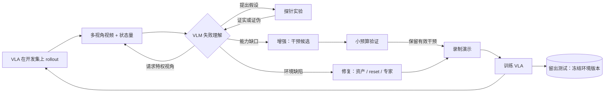

# 看懂失败，再改仿真：VLM Agent 驱动的具身模型自主迭代

研究规划 · 草案 v1 · 2026-09-25

让 VLM 以仿真视频为主证据理解 VLA 为什么失败，把失败转成对仿真任务、资产、专家与观测的修改或增强，重新录制数据、训练并评测，形成环境与策略共同进化的闭环。

- 基座：**π₀.₅（openpi）**，DM0.5 作第二基座
- 主基准：**RoboTwin 2.0 hard**
- 辅基准：**LIBERO-PRO / Plus**、**AM-Bench**

---

## 1. 动机：我们已经手工跑通过一次这个闭环

在 AM-Bench（空中操作，12 任务）上，我们用一周时间反复执行"看评测失败视频 → 定位仿真侧根因 → 修改资产、reset、专家、观测 → 重录 → 训练评测"。最终 π₀.₅ 固定配方 12 任务宏平均 56.7，组合最优 65.3，超过论文 ST-FT 的 52.22；三个专家成功率为 0 的任务全部修到可用。这段经历给出了方法的真值样本，也暴露了自动化必须解决的问题。

| 任务 | 失败现象 | 真实根因 | 修改层 | 专家成功率 |
|---|---|---|---|---|
| FrameAssembly | 夹爪一直闭合，框架却下滑 | 把手短柱只有视觉几何，无碰撞体 | 资产 | 0/16 → 80/80 |
| TossBall | 一开始运动球就掉 | 夹持 reset 缺宽度换算；球悬在前机臂上方被低头压住；桶是实心凸包 | 机器人配置、专家、资产 | 0/462 → 80/80 |
| WipeWindow | 擦两三下海绵就掉 | 海绵从未被夹住；位置控制调不出接触力 | reset、专家、观测（腕部力） | 0/32 → 80/164 |
| PushSlider | π₀.₅ 夹住后 z 向上滑脱 | 单末端相机看不到与导轨的相对位置 | 观测（机载相机）、数据（注噪） | 模型 0 → 100 |
| RotateValve | 加机载相机后超时增多 | 同一干预对不同任务作用相反 | 观测 | 模型 56.7 → 26.7 |

两条经验直接决定了研究重点：

- **不看仿真视频无法理解失败。** TossBall 上只凭日志先后怀疑夹持刚度、摩擦、求解器、手指质量，跑了十几组参数全部无效，拼出三视角帧后才看出球被压在机臂上。
- **光看视频也不够。** 夹爪开度一直是 0.002、球落进桶口瞬间被 reset 回夹爪、桶是实心的，这些在默认渲染里都看不出来，靠的是状态量、逐步轨迹和对照实验。

## 2. 相关工作与空白

约 45 篇相关工作可以归为三条互不相连的线，没有一篇把"VLA 在基准上的具体失败"转成对仿真任务、资产、专家的定点修改并回到训练。

| 流派 | 代表工作 | 做到了 | 缺少 |
|---|---|---|---|
| 批量造任务 | RoboGen、GenSim/GenSim2、RoboCasa、EmbodiedGen | 自动生成任务、资产和演示 | 开环，按多样性驱动，不看模型在哪里失败 |
| 策略自我改进 | RoboCat、Self-Improving Embodied FM、π*0.6 RECAP、SimpleVLA-RL | 用自身 rollout 让策略变强 | 任务和环境固定不变 |
| 失败诊断与课程 | AHA、REFLECT、FailBench、OMNI-EPIC、Eurekaverse、Voyager | 观察失败、影响下一步生成 | 只打分不修改，或不是物理操作加 VLA |

> **必须正面回应的近邻：RoboTwin 2.0。** 它自带"MLLM 写任务代码、仿真执行反馈"的闭环，已生成 10 万条以上专家轨迹。它的反馈信号是专家代码能否执行成功，而不是训练出的 VLA 在哪里、为什么失败。我们的差异点在反馈信号和修改依据。
>
> **VLM 当裁判的可靠性不足：** FailBench 测得接触丰富任务上 VLM 判别准确率仅 0.6–0.77。直接让 VLM 看一眼视频就下结论，支撑不了自动闭环。

## 3. 核心创新点

### 创新点一（核心）：以仿真视频为主证据的具身失败理解

- **视频为主证据**：输入多视角 rollout 视频，定位失败时刻，区分现象与根因。例如"框架下滑"是现象，"把手无碰撞体"是根因。
- **仿真特权视角**：VLM 可主动请求真实世界没有的渲染，包括碰撞体网格、接触点与接触力、质心轨迹、慢放和局部放大。把手无碰撞体、实心桶这类缺陷在碰撞体视图里一帧可见。
- **主动探针验证**：看完视频提出假设，设计最小对照实验去证伪，例如"静止保持不丢球、仅俯仰就丢球"。把看视频的不确定性转为可验证的结论，对冲 VLM 判别不可靠的问题。

### 创新点二（方法）：失败驱动的环境编辑，区分"修复"与"增强"

- **修复**：针对环境或数据缺陷（碰撞体缺失、reset 错误、专家不成功）。诊断对了修法基本确定，用"修改后专家能否成功"验证。
- **增强**：针对模型能力缺口（环境与专家无误但 VLA 学不会）。VLM 不可能事先知道正确答案，因此做成"诊断缺口类型 → 从干预库提候选 → 小预算验证 → 保留有效者"的搜索。干预库包括换观测模态、失败状态附近造初始条件、注噪录纠正演示、拆分子技能课程、反事实变体。
- **经验库**：记录"失败类型、干预、效果"，跨任务复用。编辑范围覆盖四层：任务定义、资产物理、脚本专家、观测模态。让 Agent 决定模型该看什么，文献中没有先例。

### 创新点三（数据与评测）：带真值的具身失败视频基准

- 向仿真任务注入已知缺陷（去碰撞体、错工具点、实心容器、限速、错误 reset、错误摩擦），自动批量生成"视频、状态、根因标签"样本；再加入 AM-Bench 上真实发现的缺陷作为真实分布测试集。
- 用途一：评测现有 VLM 从视频理解具身失败的能力，预计分数偏低，本身即是发现。
- 用途二：作为训练数据微调专门的失败理解 VLM。

## 4. 闭环框架概要

具体方案暂不深入，下图只界定模块边界和信息流。

## 5. 数据、基准与基础模型

| 角色 | 基准 | 现状 | 选择理由 |
|---|---|---|---|
| 主基准 | RoboTwin 2.0（hard，域随机化） | π₀ clean 21.0%，DR 微调 29.8%；π₀.₅ 无官方数字 | 未饱和；自带可编程专家和数据生成管线；SAPIEN 可改资产；有 LeRobot 转换脚本 |
| 快速验证 | LIBERO-PRO / LIBERO-Plus | 原版 π₀.₅ ≈96.5%；位置扰动后 0.08–0.38 | 单卡评测，openpi 脚手架最全；失败按扰动轴划分，适合先把闭环跑通 |
| 跨本体 | AM-Bench（空中操作） | 我们 56.7 / 65.3，论文 52.22 | 已有完整人工闭环记录与真实缺陷，可直接作为 Agent 诊断的真值 |
| 后期可选 | BEHAVIOR-1K | 2025 挑战赛冠军约 12.4% | 最难、基于 π₀.₅，但一轮训练加评测约千 GPU 时，只做一次终验 |
| 备选 | ManiSkill3 / GemBench | π₀.₅ MultiTask 40.1%；GemBench L4 0.3% | ManiSkill3 基础设施最灵活；GemBench 泛化轴分解最清晰但依赖 CoppeliaSim |

- **基座模型**：π₀.₅（openpi）为主；DM0.5 作为第二基座，验证方法与基座无关。
- **Agent**：一个前沿闭源 VLM 为主力，一个开源 VLM（如 Qwen-VL 系列）作对照，观察方法对 Agent 能力的依赖；创新点三的数据可用于微调开源 VLM。
- **数据**：各基准官方演示为起点，Agent 产生的修复和增强数据单独记账；失败视频基准由缺陷注入自动生成。

## 6. 评测协议：防止泄露

看到哪里失败就造哪里的数据，可能只是在拟合测试集。我们在 AM-Bench 上就踩过其中最隐蔽的一种。协议必须同时处理三种泄露。

| 泄露类型 | 表现 | 对策 |
|---|---|---|
| 测试条件泄露 | 针对测试集失败的初始位置专门造数据 | Agent 只观察开发集 rollout（不同种子、物体实例）；最终在从未见过的种子上评测 |
| 任务级过拟合 | 在某任务反复迭代，提升只对该任务有效 | 留出任务：Agent 只在部分任务上迭代，测未碰过的任务；LIBERO-Plus 按扰动类型留出 |
| 修环境等于改考卷 | 修复碰撞体、空心桶后测试环境本身变简单 | 冻结修复后的环境版本，所有对照组在同一版本上训练评测；"基准修复"与"训练增强"分两本账，前者不计入方法提升 |

- **完整性约束**：Agent 不得修改成功判据和评测集；所有编辑按"修复"或"改变难度"分类并留痕，改变难度的编辑需人工确认。AM-Bench 上 WipeWindow 判据半径就是交由人决定的，论文中写成机制。
- **泛化假设**：实例级干预（在失败位置多录）只在原分布有效；能力级干预（新观测、纠正演示）可迁移到其他任务。已有佐证：双相机加注噪使 PushSlider 0 → 100，同时 PegInHole +33。

## 7. 需要达成的实验效果

| 实验 | 设置 | 目标 |
|---|---|---|
| 主结果 | RoboTwin hard、LIBERO-PRO，相同 GPU 预算。对照：固定官方数据、同任务加量录制、开环生成（随机域随机化或 RoboTwin 式变体）、仅策略自改进（DAgger / RL 微调）、人工闭环上界 | 显著超过"加量录制"与"开环生成"；RoboTwin hard 宏平均 +15～20 点；LIBERO-PRO 从 0.3 左右回到 0.7 以上；给出迭代轮数–成功率曲线 |
| 跨本体 | AM-Bench 12 任务，从未修复版本起步 | Agent 自主让至少一个 0% 任务可用；宏平均超过人工闭环的 65.3 |
| 失败理解 | 失败视频基准，四档输入：仅日志与指标 / 默认视角视频 / 加特权视角 / 再加主动探针 | 根因定位准确率逐档上升，探针档显著超过 FailBench 报告的 0.6–0.77；四档接入闭环后的最终成功率随之提升 |
| 泛化 | 留出任务、留出扰动类型；与同数据量非针对性加数据对比 | 留出任务上有正向提升且无显著退化；能力级干预的迁移收益大于实例级 |
| 消融与成本 | 失败驱动 vs 随机编辑；四层编辑逐层开启；换 Agent 模型 | 报告每层贡献、GPU 时与 API 费用、每个缺陷消耗的探针实验次数 |

每格至少 100 次 rollout 或多种子。AM-Bench 上每格 30 次时误差约 ±9 个点，不足以支撑主结论。

## 8. 风险与待定事项

- **与 RoboTwin 2.0 的重叠**：引言需明确反馈信号的差异，并在其原生管线上做直接对照。
- **接触丰富任务上 VLM 诊断不稳**：探针实验与特权视角正是为此设计；必要时用创新点三的数据微调专用模型。
- **算力**：闭环每轮包含录制、训练、评测，需用小预算代理实验筛选干预，只对入选干预做完整训练。
- **π₀.₅ 基线缺失**：RoboTwin 2.0 无官方 π₀.₅ 数字，立项第一周自行补测。

**待决定**

1. 论文主线：以"视频失败理解"为核心的方法论文，还是"方法加失败视频基准"的双贡献论文。
2. 主基准：RoboTwin 2.0（故事完整）还是 LIBERO-PRO（迭代更快）。
3. 目标会议与时间线。

## 9. 主要参考

- [AM-Bench](https://arxiv.org/abs/2609.00641)（arXiv 2609.00641）
- [RoboTwin 2.0](https://arxiv.org/abs/2506.18088)（arXiv 2506.18088）
- [OMNI-EPIC](https://arxiv.org/abs/2405.15568)（arXiv 2405.15568）
- [BBSEA](https://arxiv.org/abs/2402.08212)（arXiv 2402.08212）
- [GemBench](https://arxiv.org/abs/2410.01345)（arXiv 2410.01345）
- [COLOSSEUM](https://arxiv.org/abs/2402.08191)（arXiv 2402.08191）
- [ManiSkill3](https://arxiv.org/abs/2410.00425)（arXiv 2410.00425）
- [RLinf VLA](https://arxiv.org/abs/2510.25889)（arXiv 2510.25889）
- [BEHAVIOR 2025 冠军方案](https://arxiv.org/html/2512.06951)（arXiv 2512.06951）
- [RoboCasa365 排行榜](https://github.com/robocasa-benchmark/leaderboard)

完整文献与基准调研见同目录的 `调研_AI4AI与RSI具身.md` 与 `调研_地面操作仿真基准.md`，其中标注"待核实"的条目立项前需人工复核。
